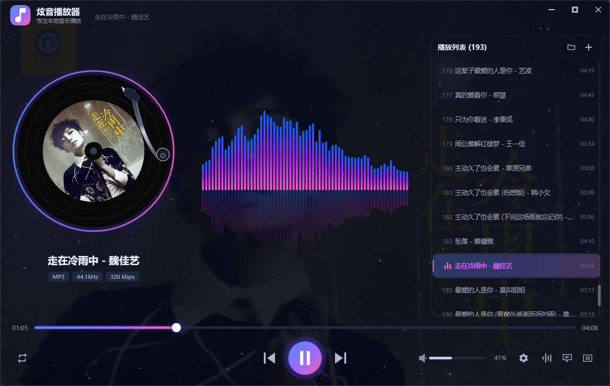

# 炫音播放器（Mp3Player）

一款 Windows 桌面本地音乐播放器，使用 C# / WPF（.NET 8）开发。
深色科技风 + 玻璃拟态 + Neon 霓虹光效，参考酷狗概念版的视觉风格，完全本地离线播放，无任何在线功能。



## 快速运行

- 直接双击 `publish-single\Mp3Player_v1.0.0.exe` 即可运行，无需安装 .NET（运行时已打包进单文件，文件名中的版本号随每次发布更新）。
- 单文件自包含，支持 Windows 10/11 x64。
- 程序为单实例，重复启动会提示"已在运行"。

## 功能特性

### 播放与列表

- 支持 mp3 / wav / m4a / flac / aac / wma / ogg 音频文件
- 点击按钮添加文件，一键添加整个文件夹（自动递归扫描子目录），也支持把文件拖进窗口添加
- 播放列表自动保存，下次启动自动恢复，异常退出也不丢
- 自动读取歌曲内嵌封面、歌名、歌手、专辑信息（TagLib）
- 歌曲信息徽标：MP3 / 44.1kHz / 比特率

### 视觉特效

- 320px 黑胶唱片：蓝紫渐变光环（呼吸效果）+ 黑胶纹理 + 播放时旋转，暂停即停
- 复古唱臂：播放时落下，暂停时抬起
- 实时音乐频谱：64 根律动光柱，NAudio FFT 真实分析（对数频率映射 + dB 动态归一化），蓝紫粉渐变，上下镜像 + 水面倒影，不播放时完全静止
- 星空背景：100 颗星星闪烁发光
- 深蓝黑渐变窗口背景 + 左右紫/蓝光晕
- 60px 自定义标题栏：渐变 Logo + 标题 + 副标题
- 全局圆角窗口，除功能控件外任意位置可拖动
- 动效：打开淡入、托盘隐藏淡出、光环呼吸

### 播放控制

- 播放/暂停、上一曲、下一曲（直接切歌，不从开头重播）
- 进度条可拖动快进
- 顺序播放 / 单曲循环 / 随机播放三种模式，点击模式按钮弹出菜单选择；顺序模式最后一首播完自动循环到第一首
- 音量滑块 + 百分比显示 + 声音图标，点击图标一键静音/恢复
- 5 段均衡器（低音 / 中低 / 中音 / 中高 / 高音，-12dB ~ +12dB），自绘渐变发光滑块
- 记住上次播放位置，重新打开自动续播
- 记住音量、播放模式、窗口位置与大小、播放列表

### 扩展功能

- 系统托盘：关闭窗口最小化到托盘，单击图标显示/隐藏窗口，托盘右键菜单
- 桌面歌词悬浮窗（LRC），支持 UTF-8 / GBK 编码
- 迷你模式小窗
- 全局快捷键：键盘媒体键 + Ctrl+Alt 组合键
- 设置面板（齿轮按钮）：可开关实时频谱、星空背景，立即生效并自动保存

## 快捷键

| 按键 | 功能 |
| --- | --- |
| 空格 | 播放 / 暂停 |
| ← / → | 快退 / 快进 5 秒 |
| ↑ / ↓ | 音量 + / - |
| Ctrl + ← / → | 上一曲 / 下一曲 |
| Ctrl + Alt + P / N / B | 播放暂停 / 下一曲 / 上一曲（全局） |
| 键盘媒体键 | 播放暂停 / 切歌（全局，兼容性最好） |
| Delete（播放列表） | 删除选中歌曲 |

## 歌词

将歌词文件命名为与歌曲相同并放在同一目录，例如 `歌曲名.mp3` 对应 `歌曲名.lrc`，
支持 UTF-8 和 GBK 编码。

## 数据位置

播放列表、音量、均衡器、播放模式、窗口状态、上次播放位置等全部保存在
`publish-single\data\settings.json`，删除该文件即可恢复默认设置。

## 项目结构

```
D:\MP3player
├─ publish-single\            # 发布目录（唯一运行形态）
│  ├─ Mp3Player_v1.0.0.exe    # 单文件自包含可执行程序（文件名带版本号）
│  └─ data\settings.json      # 用户数据（播放列表、设置）
├─ App.xaml(.cs)              # 入口，单实例互斥
├─ MainWindow.xaml(.cs)       # 主窗口（播放、频谱、唱片、列表、托盘、快捷键等）
├─ MiniPlayerWindow.xaml(.cs) # 迷你模式窗口
├─ LyricWindow.xaml(.cs)      # 桌面歌词悬浮窗
├─ Controls\SlimScrollBar.cs  # 自定义细长滚动条
├─ Models\SongItem.cs         # 歌曲模型
├─ Services\                  # 核心服务
│  ├─ PlayerService.cs        # NAudio 播放 + FFT 频谱
│  ├─ EqualizerSampleProvider.cs # 5 段均衡器
│  ├─ TagReader.cs            # TagLib 标签/封面读取
│  ├─ LrcParser.cs            # LRC 歌词解析
│  ├─ SettingsService.cs      # 设置持久化
│  └─ HotkeyService.cs        # 全局快捷键
├─ Assets\app.ico             # 应用图标
├─ NuGet.Config               # NuGet 包缓存指向 D 盘
└─ Mp3Player.csproj           # 工程文件（.NET 8 + WPF）
```

## 开发与发布

依赖仅有 2 个 NuGet 包：NAudio 2.2.1、TagLibSharp 2.3.0。

> 注意：`.NET SDK` 不放在项目目录里，固定安装在 `D:\.NET\_SDK`（D 盘、不占 C 盘）。
> 需要开发或发布时，先下载 .NET 8 SDK（win-x64 zip 版）解压到 `D:\.NET\_SDK`，
> `NuGet.Config` 已把包缓存指向 `D:\MP3player\.nuget`，不会占用 C 盘。

发布单文件自包含程序（含压缩）：

```powershell
dotnet publish -c Release -r win-x64 --self-contained true `
  -p:PublishSingleFile=true `
  -p:IncludeNativeLibrariesForSelfExtract=true `
  -p:EnableCompressionInSingleFile=true `
  -o publish-single
```

### 版本号规则

- 版本号格式为 `主版本.次版本`（当前 1.0.0），维护在 `Mp3Player.csproj` 的 `<Version>` 中
- 小改动（修复 bug、界面微调）：次版本号 +1，如 `1.0.0 → 1.1.0`
- 大改动（新功能、界面重构、重大变更）：主版本号 +1，如 `1.1.0 → 2.0.0`
- 发布后把 exe 重命名为 `Mp3Player_v<版本号>.exe`，并同步更新桌面快捷方式

发布注意事项：

- 发布前先关闭正在运行的 `Mp3Player.exe`，否则 exe 被占用会发布失败
- 发布后删除 `publish-single\Mp3Player.pdb`
- 发布后把 `publish-single\Mp3Player.exe` 重命名为 `Mp3Player_v<版本号>.exe`，并同步更新桌面快捷方式
- 保留 `publish-single\data\settings.json`，不要覆盖用户数据